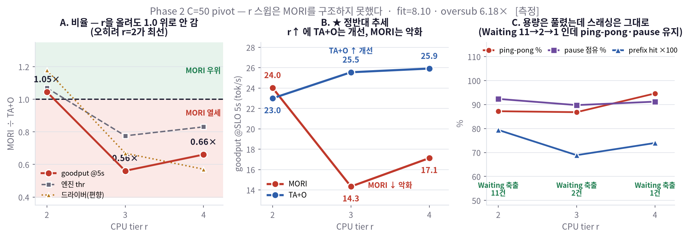

# Phase 2 — r 스윕으로 붕괴 원인 격리 (**완료**)

- 기간: 2026-08-04 ~ / 브랜치: `mori` (커밋 없음)
- 하드웨어: goguma6, RTX 5090 ×2 TP2, Qwen3-8B, SGLang + HiCache, Track M 트레이스
- 목적: H200 렌트 **전에**, 5090에서 "MORI 붕괴 원인"을 격리한다.
- 제약 준수: baseline / 원본 trace / 기존 스크립트 **0-line diff**. 신규는 러너·샘플러·분석기만.
- 라벨: **[측정]** 관측값 · **[추론]** 해석 · **[추정]** 계산·외삽
- ✅ **Phase 2 종료.** 마지막 갱신 2026-08-05 21:40 KST — **6/6셀 완료**(21:18 KST). 판정 §7.

---

## 0. 한 눈 요약 (현재까지)

| # | 마일스톤 | 결과 | 상태 |
|---|---|---|---|
| M1 | 20분 셀 매트릭스 | **프로토콜 편향 발견 → 폐기** | 종료 (§2) |
| M2 | 1시간 앵커 게이트 `MORI_r2_C20` | **PASS** 1.29× | 종료 (§3) |
| M3 | 1시간 `r2 C32` pivot | **예측 빗나감** (패 예측 → 1.11× 승) | 종료 (§4) |
| M4 | **C=50 pivot, r∈{2,3,4}** | 6/6셀 · goodput 비 **1.05× → 0.56× → 0.66×** | 종료 (§6.7) |
| — | **최종 판정** | **【GPU-fit lever】** — r은 MORI를 구조하지 못했고, 오히려 해로웠다 | §7 |

**최종 결론 [추론]**: **CPU 용량(r/DRAM)은 lever가 아니다.**
r을 2→4로 올려 MORI의 Waiting 축출을 11→1로 사실상 없앴는데도(=원인 ① 제거) goodput 비는
1.05× → 0.66×로 **떨어졌고**, 스래싱 지표(ping-pong 87→95%, pause 점유 ~91%)는 전혀 안 내려갔다.
남는 원인은 **GPU 슬롯 경쟁(oversub = C ÷ fit)** 하나다 → **lever = HBM(fit) → H200 필수**.
사이징 예산은 DRAM이 아니라 **HBM에 집중**해야 한다(§7이 §7 원안을 뒤집는다).

---

## 1. 왜 이 실험인가

STEP 6/7에서 확정된 것: **코드는 논문 정책에 충실**(A 17/17)하고, C80 붕괴는 정책 오구현이 아니다.
남은 후보는 **레짐**인데, 레짐 안에도 서로 다른 자원에 걸린 원인이 **둘** 있다:

| 원인 | 무슨 일이 | 증상 | lever |
|---|---|---|---|
| **① CPU tier 용량 부족** | demote된 KV를 받을 자리가 없어 폐기 → Waiting → 재개 시 **full recompute** | Waiting 축출>0 · recompute율↑ | **r** (CPU tier = DRAM) |
| **② GPU 슬롯 경쟁(스래싱)** | CPU를 키워도 GPU는 여전히 fit(≈8)칸 — C개가 8자리를 다툼 | ping-pong↑ · prefix hit↓ · pause↑ | **fit** (GPU풀 = HBM) |

**r은 CPU 상자만 키우고 fit은 전혀 안 바꾼다** → r을 올려 Waiting=0을 만든 뒤
throughput이 회복되면 ①, 정체하면 ②. 이 한 가지가 H200 예산 배분(DRAM vs HBM)을 결정한다.

### 개념 정의 [측정]
```
fit      = GPU풀 ÷ ctx_median = 262,144 ÷ 32,376 = 8.10      (GPU 동시 수용 프로그램 수)
oversub  = C ÷ fit                                            (C32 → 3.95× · C50 → 6.18×)
r        = CPU tier 배수 (CPU tier = r × GPU풀)
수용률   = (1+r) × fit ÷ C        →  C_crit = (1+r) × fit
```

---

## 2. M1 — 20분 셀은 MORI를 체계적으로 불리하게 만든다 (폐기) [측정]

처음 매트릭스는 20분 셀이었다. 앵커에서 이상이 나와 중단하고 원인을 팠다.

**원인**: 드라이버 throughput이 **완료된 프로그램만** 집계한다
(`mori_replay_driver_yunuikang.py:300-317` — *"Programs still in flight at the deadline never entered `ok`"*).
MORI는 설계상 프로그램을 pause/demote해 **완주 시간을 늘리므로**, 마감 시각에 미완인 프로그램이
많아지고 그 토큰이 통째로 빠진다. → **MORI에만 걸리는 편향.**

| 셀 | 20분 | 1시간 | 변화 |
|---|---|---|---|
| `MORI_r2_C20` (드라이버) | **14.88** | **25.73** | **+72.9%** |

같은 셀에서 드라이버 0.57× vs 엔진(완료 무관) 0.86× 로 갈린 것이 직접 근거.

**조치**: 셀 1시간(M-SWP와 동일)으로 복귀 + **불편향 교차지표 3종 배선**
- 엔진 steady-window 토큰 (`/metrics` 5초 폴링 차분) — 완료 무관
- Waiting 축출 (프록시 로그)
- goodput@5s (`--profile` per-step: `pause_s + prefill_s ≤ SLO`)

20분 산출물은 `scratch/mori/phase2_20min_ARCHIVE/`에 **보존**(편향 자체가 근거 자료).

---

## 3. M2 — 1시간 앵커 게이트 **PASS** [측정]

`MORI_r2_C20` 1셀만 먼저 돌려 프로토콜이 복원되는지 확인.
TA+O 기준선은 M-SWP `TAO_r2_C20 = 19.9` 재사용 — `tr` 라우터는 **A7c 수정의 영향을 받지 않기** 때문.
(반대로 MORI는 수정 후 코드이므로 반드시 재측정이 필요했다.)

| 기준 | 값 | vs TA+O 19.9 |
|---|---|---|
| M-SWP (A7c 수정 **전**) | 22.2 | 1.12× |
| **이번 앵커** (수정 **후**) | **25.73** | **1.29×** ✅ |

**불편향 교차지표** (전부 [측정]):

| 지표 | 값 |
|---|---|
| 엔진 steady-window | **31.11** tok/s (창 3,010s · 샘플 603) |
| 스텝기준(profile) | 30.93 tok/s |
| **goodput @5s** | **26.35** tok/s (만족 85.4%) |
| goodput @2s | 21.77 tok/s (70.5%) |
| Waiting 축출 | **0** |
| prefix hit / recompute율 | 0.856 / 0.144 |
| pause>0 스텝 / 중앙값 | 9.7% / **0.00s** |

[추론] 엔진(31.11)과 스텝기준(30.93)이 거의 일치 → 두 독립 계측이 서로를 검증.
드라이버(25.73)가 17% 낮은 것이 완료-경계 손실분.
[추론] MORI 자체가 22.2 → 25.73 (+15.9%)인 것은 A7c LRU 수정 효과일 **가능성**이 있으나
n=1이고 코드·시점이 모두 달라 단정하지 않는다.

---

## 4. M3 — `r2 C32`: 예측 패, 실측 **승** [측정]

| 셀 | 엔진(불편향) | goodput@5s | 드라이버 | Waiting 축출 | ping-pong | prefix hit |
|---|---|---|---|---|---|---|
| `MORI_r2_C32` | **31.62** | **25.66** | 21.93 | **3** (CPU→W) | 83% | 0.827 |
| `TAO_r2_C32` | 28.42 | 23.81 | 19.50 | 431 (GPU→W pause) | 71% | 0.887 |
| **비 (MORI÷TA+O)** | **1.11×** | **1.08×** | 1.12× | — | — | — |

예측은 "패"(C32 > C_crit 24.3)였는데 **3지표 모두 승**.

### 왜 빗나갔나 [측정→추론]
**Waiting 넘침 자체가 안 일어났다** — MORI의 CPU→Waiting 축출이 **3건**뿐.
dial②의 전제(용량 부족 → 넘침)가 성립하지 않았으므로 붕괴할 이유가 없었다.
→ **메커니즘 반증이 아니라 `C_crit` 공식의 과대평가.**

명목 워크셋 `C × ctx_median`이 실제 수요를 과대평가한다 [측정]:

| | 값 |
|---|---|
| 명목 워크셋 (C32) | 1,036,032 tok |
| 실제 상주 (GPU p95 234,676 + host p95 524,229) | **758,905 tok** |
| **실효/명목** | **0.73** |
| GPU+CPU 용량 (3 × 262,144) | 786,432 tok → **수용률 104%** |

> ⚠️ 이 0.73은 **host pool이 포화(524,229/524,289)된 상태**에서 잰 값이라
> 상한에 눌린 측정치일 수 있다. 다만 축출이 3건뿐이므로 실제 수요가 용량을 크게 넘지 않은 것은 확실하다.
> C=50 실험이 이 계수를 직접 검증한다.

### 경험적 임계 [측정]

| C (r=2) | MORI÷TA+O | 출처 |
|---|---|---|
| 20 | **1.29× 승** | Phase 2 앵커 (1h) |
| **32** | **1.11× 승** | Phase 2 (1h) |
| 50 | 0.73× 패 | M-SWP (1h, 수정 전 코드) |
| 80 | 0.45× 패 | M-SWP (1h, 수정 전 코드) |

→ 실측 임계는 **C 32~50 사이**. 공식의 24.3보다 훨씬 높다.

---

## 5. M3 이후 — 왜 기존 격자를 폐기했나 [추론]

계획된 잔여 격자는 C **32/40/48** × r{3,4}였다. r을 올리면 용량만 더 늘어나므로
**전부 "승"만 나온다** → 1.0 교차가 안 생겨 **판정 1을 반증 불가**.
8.3시간을 "다 이겼다" 확인에 쓰게 되므로 중단했다.

**또 하나의 관찰** [측정]: 재프레이밍 시점에는 C=32(승, 3건)와 M-SWP C=50(패, **4건**)의 축출이
거의 같아 "C50 패배는 Waiting 넘침이 아니다"라고 판단했다.
> ⚠️ **정정 (2026-08-05)**: 같은 프로토콜로 다시 잰 `MORI_r2_C50`의 축출은 **11건**이었다
> (M-SWP 4건은 A7c 수정 전 코드·다른 세션). 즉 C=50에서는 **용량 부족도 실제로 발현**한다.
> 재프레이밍의 동기(두 원인 구분)는 여전히 유효하지만, C=50은 ①②가 **혼재**한 지점이다.
STEP 7에서도 C80 붕괴는 Waiting(1.3%)이 아니라 스래싱(ping-pong 90.7%, pause)이 지배했다.
→ **§1의 두 원인을 구분해야 한다**는 재프레이밍의 근거.

---

## 6. M4 — C=50 pivot (**완료**)

> 하위 절은 **기록 순서**(관측한 순서)로 붙어 있어 번호가 순차적이지 않다.
> **결과만 볼 때 읽는 순서**: **6.8**(6셀 전체 표·그림) → **6.9**(반증테스트) → **§7**(판정).
> 6.1·6.3·6.4·6.6·6.7은 셀별 관측 기록, **6.5**는 계산법 오류 정정, **6.2**는 C 스윕 대조군이다.

### 설계
**수식에서 바꾼 값은 C 하나.** fit(8.10)은 5090에서 고정, r 스윕은 원래 목적이라 유지.

```
C: 32 → 50        oversub: 3.95× → 6.18×      (MORI가 실제로 지는 구간)
수용률 = (1+r) × fit ÷ (0.73 × C)
```

| C=50 | 수용률(0.73 보정) | 예측 | 판별 신호 |
|---|---|---|---|
| r=2 | **67 %** | 패 | Waiting↑ · ping-pong↑ · pause↑ |
| r=3 | 89 % | 경계 | 중간 |
| r=4 | **111 %** | **승 ← 교차** | Waiting≈0 · ping-pong↓ · pause↓ |

### 매트릭스 (6셀, 전부 1시간, 반복 없음)
`for r in {2,3,4}: MORI(mori 라우터) 1h · TA+O(tr 라우터) 1h`
- 엔진 재기동은 **(EVICT, RATIO) 축** → MORI=`mori` / TA+O=`lru` 이므로 **r당 2회, 총 6회**
- M-SWP 옛 수치 **재사용 금지** — 비율은 같은 세션의 MORI÷TA+O 로만 판정
  (앵커가 1.29× vs 1.12×로 ~15% run 변동을 보였음)

### 실현가능성 [측정]
| r | host KV | 기동 후 여유 (DRAM 188G) |
|---|---|---|
| 2 | 72.0 GiB | 110 GiB |
| 3 | 108.0 GiB | 74 GiB |
| 4 | **144.0 GiB** | **38 GiB** |

r=4는 사전 프로브에서 **기동 성공 + 불변식 I6 성립** 확인
(rank당 77.31 GB × 2 · `CpuTier.capacity=1,048,576` == host pool `1,048,577`).
셀마다 assert가 재실행되며, 셀 시작 전 DRAM 가드(<8 GiB면 스킵)를 둔다.

### 측정 지표
| 군 | 지표 |
|---|---|
| **불편향 3종** | 엔진 steady-window tok/s · Waiting 축출 · goodput@5s |
| **스래싱 3종** | ping-pong% · prefix cache hit · **pause 점유(TTFT 중 비중)** |
| 참고 | 드라이버 throughput (편향 크기 확인용) |

### 판정 로직 (사전 등록)
1. `r2 C50`에서 **패 재현** 확인 (M-SWP 0.73×와 정성 대조)
2. r=2→3→4 궤적:
   - **【CPU 용량 lever】** 비율 상승 → r4에서 >1 교차 + Waiting↓ + ping-pong/pause↓
     → 원인 = CPU 용량. **lever = DRAM.** 5090에서도 완화 가능, H200은 확증용
   - **【GPU-fit lever】** Waiting은 0인데 비율 정체(<1) + ping-pong/pause 여전
     → 원인 = GPU-oversub 스래싱. **lever = fit(HBM) → H200 필수**, 예산을 HBM에 집중
3. 두 지표군(throughput 비 vs 스래싱 궤적)이 **같은 방향**을 가리키는지 정합 확인

### 진행 상황
| 셀 | 상태 | 완료(KST) |
|---|---|---|
| `MORI_r2_C50` | ✅ **완료** (I6 통과) | 15:52 |
| `TAO_r2_C50` | ✅ **완료** | 16:56 |
| r3 2셀 | ✅ **완료** | 19:06 |
| r4 2셀 | ✅ **완료** | 21:18 |

총 6셀 × 1시간, 반복 없음(n=1). 실 소요 ≈ 8시간(부팅·정리 포함).

### 6.1 `MORI_r2_C50` 결과 [측정] — TA+O 짝 대기 중이라 **비율 판정은 아직 불가**

| 지표 | 값 |
|---|---|
| 엔진 steady-window | **30.95** tok/s |
| goodput @5s | **24.03** tok/s (만족 76.8%) |
| 드라이버 (참고) | 17.82 tok/s · ttft_p50 2.90s · steady_turns 1,191 · fail 0 |
| **Waiting 축출** | **11** (C32는 3) ← 용량 부족이 실제로 발현 |
| ping-pong | 87% |
| prefix hit / recompute율 | 0.794 / 0.206 |
| **pause 점유** | **92.3%** |

### 6.3 ★ r=2 짝 완성 — **지표가 서로 다른 방향을 가리킨다** [측정]

| 지표 | MORI | TA+O | 비 (M÷T) | 판정 |
|---|---|---|---|---|
| 엔진 steady-window | **30.95** | 28.94 | **1.07×** | MORI 승 |
| **goodput @5s** | **24.03** | 22.99 | **1.05×** | MORI 승 |
| 드라이버 (편향, 참고) | 17.82 | 15.12 | 1.18× | MORI 승 |
| SLO 5s 만족률 | 76.8% | 79.9% | — | MORI 낮음 |

**[측정] 세 지표 모두 >1 — C=50 r=2 에서도 MORI는 지지 않는다.**
→ **M-SWP의 `C50 r2 = 0.73×`(패)는 이 프로토콜·이 코드에서 재현되지 않았다.**
[추론] 차이 후보: (a) A7c LRU 수정, (b) M-SWP는 수정 전 코드·다른 세션, (c) run 변동(~15%).
→ **"MORI가 지는 지점"을 C=50으로 잡은 전제 자체가 무너졌다.** r 스윕의 해석은 §6.5 이후를 볼 것.
판정 기준은 **goodput 1차**(SLO 만족 산출만이 유용한 일), 엔진 thr 병기.

### 6.4 ★ 스래싱 지표가 두 시스템에서 사실상 동일 [측정]

| | MORI | TA+O |
|---|---|---|
| ping-pong | 87% | **89%** |
| pause 점유 | 92.3% | **92.8%** |
| prefix hit | 0.794 | 0.854 |
| Waiting | 11 (CPU→W 축출) | 582 (GPU→W pause) |

**[추론] 이것이 이번 스테이지에서 가장 중요한 관측이다.** ping-pong과 pause 점유가 MORI와 TA+O에서
**거의 같다**는 것은, 이 스래싱이 **MORI 정책의 산물이 아니라 레짐(C vs fit)의 산물**임을 뜻한다.
→ 원인 ②가 regime-driven이라는 가설과 정합. r을 올려도 이 둘이 안 내려가면 ②로 확정된다.

### 6.6 ★ r=3 결과 — **예상과 반대: r을 올리자 MORI만 악화** [측정]

| 지표 | MORI r2 | MORI r3 | 변화 | TAO r2 | TAO r3 | 변화 |
|---|---|---|---|---|---|---|
| 엔진 thr | 30.95 | 24.42 | **−21%** | 28.94 | 31.47 | +9% |
| **goodput @5s** | **24.03** | **14.34** | **−40%** | 22.99 | 25.55 | +11% |
| SLO 만족% | 76.8 | 59.6 | −22% | 79.9 | 81.5 | +2% |
| prefix hit | 0.794 | **0.689** | −13% | 0.854 | 0.861 | +1% |
| recompute율 | 0.206 | **0.311** | **+51%** | 0.145 | 0.139 | −5% |
| reload (M tok) | 12.45 | 10.36 | −17% | 4.65 | 6.29 | +35% |
| **Waiting 축출** | 11 | **2** | **−82%** ✓ | 582 | 595 | +2% |
| ping-pong | 87% | 87% | −0% | 89% | 85% | −5% |
| pause 점유 | 92.3% | 89.8% | −3% | 92.8% | 92.8% | −0% |

**궤적 (MORI÷TA+O)**

| r | 엔진 | goodput | 드라이버 | MORI Waiting | ping-pong | pause 점유 |
|---|---|---|---|---|---|---|
| 2 | 1.07× | **1.05×** | 1.18× | 11 | 87% | 92.3% |
| 3 | 0.78× | **0.56×** | 0.67× | **2** | 87% | 89.8% |

### ★ 결정적 관측 [측정]
**용량 문제는 해결됐는데(Waiting 11→2) 성능은 오히려 크게 나빠졌다.**

사전 등록 분기로는 **ⓑ 【GPU-fit lever】**에 해당한다 — `Waiting≈0` ✓, `비율 <1` ✓, `ping-pong 여전(87%)` ✓.

> ⚠️ **다만 분기 ⓑ의 정의를 넘어선다.** ⓑ는 "r을 올려도 **정체**"였는데 실제로는 **적극적으로 악화**했다.
> 사전 등록한 두 분기 어디에도 없는 **3번째 패턴**이다: *"r이 안 통한다"가 아니라 "r이 해롭다"*.

**[추론] 원인 미상.** reload는 오히려 **줄었는데**(12.45→10.36M) prefix hit이 떨어지고 recompute가 +51%다.
host pool은 r과 무관하게 **항상 100% 포화**(524k/524k · 786k/786k)였다.
후보 가설(호스트 tier typed eviction이 큰 풀에서 역효과 / 메모리 압박 등)이 있으나 **n=1이라 단정 불가**.
−40%는 관측된 run 변동(~15%)보다 훨씬 크지만, 반복 없이는 확정할 수 없다.

**r=4가 가르는 것**: 더 나빠지면 **단조 추세**로 "r이 해롭다"가 강해지고,
되돌아오면 **r=3이 이상치**일 가능성이 크다.

→ **답 (§6.7)**: 어느 쪽도 아니다. r=4는 r=3보다 **약간 회복**했지만(0.56×→0.66×)
r=2 수준(1.05×)에는 **전혀 못 돌아왔다**. "r=3 이상치"로는 설명 안 되고, 단조도 아니다.

### 6.7 ★ r=4 결과 — 6셀 완성 [측정]

| 지표 | MORI r3 | **MORI r4** | 변화 | TAO r3 | **TAO r4** | 변화 |
|---|---|---|---|---|---|---|
| 엔진 thr | 24.42 | **25.60** | +5% | 31.47 | 30.83 | −2% |
| **goodput @5s** | 14.34 | **17.12** | **+19%** | 25.55 | **25.91** | +1% |
| SLO 만족% | 59.6 | 66.1 | +11% | 81.5 | **83.9** | +3% |
| prefix hit | 0.689 | 0.740 | +7% | 0.861 | **0.880** | +2% |
| recompute율 | 0.311 | 0.260 | −16% | 0.139 | **0.119** | −14% |
| **Waiting 축출** | 2 | **1** | ≈0 ✓ | 599 | 565 | −6% |
| **ping-pong** | 87% | **95%** | **+9%p** ✗ | 85% | 89% | +5%p |
| pause 점유 | 89.8% | 91.2% | +2% | 92.8% | 94.1% | +1% |
| ttft_p50 / p95 (s) | 6.53 / 265.5 | 4.96 / 206.2 | 개선 | 2.39 / 51.7 | **1.56 / 34.7** | 개선 |

### 6.8 ★ 6셀 전체 [측정]

`fit = 8.10` · `oversub = 50 ÷ 8.10 = 6.18×` · 전 셀 1시간 · 고정창 2880s · n=1

| 셀 | **엔진 thr** | **goodput@5s** | 만족% | **Wait축출** | ping% | hit | recomp | pause점유% | 드라이버(편향) |
|---|---|---|---|---|---|---|---|---|---|
| `MORI_r2_C50` | **30.95** | **24.03** | 76.8 | 11 | 87 | 0.794 | 0.206 | 92.3 | 17.82 |
| `TAO_r2_C50` | 28.94 | 22.99 | 79.9 | 582 | 89 | 0.854 | 0.145 | 92.8 | 15.12 |
| `MORI_r3_C50` | 24.42 | 14.34 | 59.6 | **2** | 87 | 0.689 | 0.311 | 89.8 | 12.54 |
| `TAO_r3_C50` | **31.47** | 25.55 | 81.5 | 599 | 85 | 0.861 | 0.139 | 92.8 | 18.74 |
| `MORI_r4_C50` | 25.60 | 17.12 | 66.1 | **1** | **95** | 0.740 | 0.260 | 91.2 | 11.57 |
| `TAO_r4_C50` | 30.83 | **25.91** | **83.9** | 565 | 89 | **0.880** | **0.119** | 94.1 | **20.27** |

(TA+O의 "Wait축출"은 `Paused program` 카운트다 — MoriRouter의 `CPU→Waiting` 축출과 **다른 사건**이므로
두 시스템 간 절대값 비교는 무의미하고, **각 시스템 내부의 r에 따른 추세**만 읽어야 한다.)

**궤적 (MORI ÷ TA+O)**

| r | 엔진 | **goodput** | 드라이버 | MORI Waiting | ping-pong | pause 점유 |
|---|---|---|---|---|---|---|
| 2 | 1.07× | **1.05×** ✅ | 1.18× | 11 | 87% | 92.3% |
| 3 | 0.78× | **0.56×** ❌ | 0.67× | 2 | 87% | 89.8% |
| 4 | 0.83× | **0.66×** ❌ | 0.57× | 1 | **95%** | 91.2% |



*(A) 세 지표 모두 1.0 아래로 내려가 안 돌아온다 — r=2가 최선.
(B) **핵심**: r↑ 에 TA+O는 개선(23.0→25.9), MORI는 악화(24.0→17.1) — 두 시스템이 **정반대**로 반응.
(C) Waiting 축출은 11→2→1로 사실상 소멸했는데 ping-pong·pause 점유는 안 내려간다.*

### 6.9 ★ 반증테스트 결과 [측정]

사전 등록한 핵심 반증테스트는 *"같은 C에서 r=2(패) → r=4(승)로 뒤집히고 Waiting 축출 >0 → ≈0.
안 뒤집히면 dial② 가설 기각"* 이었다.

| 조건 | 예측 | 실측 | |
|---|---|---|---|
| Waiting 축출 >0 → ≈0 | 예 | **11 → 1** | ✅ 성립 |
| goodput 비 뒤집힘(패→승) | 예 | **1.05× → 0.66×** (승→패, **반대 방향**) | ❌ 실패 |

→ **dial②(CPU tier 용량) 가설 기각.** 조건의 절반만, 그것도 성능은 반대로 움직였다.
r은 자기 일(용량 확보)은 했지만 그것이 성능으로 전환되지 않았다.

### 6.5 ⚠️ 계산법 오류와 정정 — goodput 시간창 [측정]

goodput을 **두 번 잘못 보고**했다. 원인은 두 가지였고, 두 번째가 본질이다.

1. **미완성 CSV** (17:00): 셀 종료 직후 `step_profiles.csv`가 아직 다 안 쓰인 상태에서 계산.
2. **가변 시간창** (본질): 창을 파일의 `min~max completed_at`으로 잡았는데,
   **grace 구간에 끝난 낙오 스텝 몇 개가 창을 통째로 늘렸다** [측정]:

| 셀 | 마지막 5스텝 종료 시각 | 창 길이 | 낙오(>3600s) |
|---|---|---|---|
| `TAO_r2_C50` | 3642 · 3643 · **4100 · 4289 · 5050** s | **5050s** | 3 |
| `MORI_r2_C50` | 3651 · 3654 · **4040** s | 4040s | 22 |
| `MORI_r3_C50` | 3641~3643 s | 3643s | — |

→ `wall`이 최대 39% 부풀어 `TAO_r2_C50` goodput이 **22.96 → 14.77**로 요동쳤다.

**수정**: 시간창을 **고정**한다 — `[첫 스텝 + 0.2×3600, 첫 스텝 + 3600]`, `wall = 2880s`.
드라이버의 steady 정의와 일치하고 낙오 스텝에 면역이다.
(`analyze_phase2_c50_yunuikang.py: profile()`)

**정정 이력**

| 값 | 1차 보고 | 2차 보고 | **확정(고정창)** |
|---|---|---|---|
| `MORI_r2_C50` goodput | 23.98 | 20.79 | **24.03** |
| `TAO_r2_C50` goodput | — | 22.96 | **22.99** |
| **r=2 goodput 비** | — | **0.91× (패)** | **1.05× (승)** |

→ "MORI가 goodput에서 진다"는 2차 보고는 **철회**한다. 세 지표 모두 MORI 승이다.
§6.2의 C20/C32 값도 고정창으로 재계산해 반영했다(26.35→26.76, 25.66→25.80).

**운영 규칙**: 셀 종료 후 CSV `mtime`이 60초 이상 지난 뒤에만 계산한다.

### 6.2 ★ r=2 고정, C만 올린 스래싱 궤적 [측정]

| 셀 | oversub | 엔진 thr | goodput | 만족% | **Waiting 축출** | **pause 점유%** |
|---|---|---|---|---|---|---|
| `MORI_r2_C20` | 2.47× | 31.11 | 26.76 | 85.2 | **0** | 80.5 |
| `MORI_r2_C32` | 3.95× | 31.62 | 25.80 | 81.3 | **3** | 85.9 |
| `MORI_r2_C50` | 6.18× | **30.95** | **24.03** | **76.8** | **11** | **92.3** |

(goodput·만족%·pause점유는 **고정창 2880s** 재계산값 — §6.5 참조)

**[측정] 두 가지가 동시에 올라간다** — Waiting 축출(0→3→11)과 pause 점유(80.5→92.4%).
C=50에서는 원인 ①(용량)과 ②(슬롯 경쟁)가 **함께** 나타난다. dial②의 전제(용량 부족)가 이번엔 성립했다.

**[추론] 가장 특징적인 것: 엔진 throughput이 거의 불변**(31.11 → 31.62 → 30.95)인데
goodput만 26.76 → 24.03으로 떨어지고 pause 점유가 92.3%까지 오른다.
→ "GPU가 일을 못 해서"가 아니라 **"만든 결과가 늦게 도착해서"** 나빠지는 패턴 = 원인 ②의 서명.
다만 Waiting 축출도 11건이라 ①도 동시 작동 → **혼합일 가능성**. r 스윕이 이를 분리한다:
r을 올려 Waiting을 0으로 만들었을 때 pause 점유와 goodput이 따라 회복하는지가 판별선.

---

## 7. 판정 및 H200 함의

### 7.1 판정 — 【GPU-fit lever】 [측정→추론]

분석기 자동 판정: *"r을 올려도 구조 안 됨 + 스래싱 여전 → 원인 = GPU-oversub. lever = HBM(fit). H200 필수."*

근거 3종이 서로 정합한다 [측정]:

| # | 관측 | 읽는 법 |
|---|---|---|
| 1 | MORI Waiting 축출 **11 → 2 → 1** | 원인 ①(CPU tier 용량 부족)은 r로 **실제로 제거됐다** |
| 2 | 그런데 goodput 비 **1.05× → 0.56× → 0.66×** | ①을 없앴는데 성능은 **회복 안 됨** → ①이 병목이 아니었다 |
| 3 | ping-pong **87 → 87 → 95%**, pause 점유 **~91%** 고정 | 스래싱은 r에 **전혀 반응 안 함** → r이 못 건드리는 자원에 걸려 있다 |

**[추론]** r이 못 건드리는 자원은 정의상 하나뿐이다 — **GPU 슬롯(fit)**.
`r`은 CPU tier 상자만 키우고 `fit = GPU풀 ÷ ctx_median = 8.10`은 그대로 둔다(§1 개념도, 두 원인 그림 참조).
C=50에서 `oversub = 6.18×`, 즉 **50개 프로그램이 8칸을 두고 도는 구조 자체**가 병목이다.
이건 §6.4에서 이미 예고됐다 — 스래싱 지표가 MORI와 TA+O에서 **거의 같았다**(87 vs 89%, 92.3 vs 92.8%).
정책이 만든 게 아니라 **레짐이 만든 것**이므로, 정책 쪽 손잡이(r)로는 못 고친다.

**lever = HBM ↑ → GPU풀 ↑ → fit ↑ → oversub ↓.** 5090(32 GB)에서는 불가능하고, H200(141 GB)이 유일한 경로다.

### 7.2 ⚠️ 이 판정의 한계 — 사전 등록 분기를 넘어선 부분 [추론]

솔직히 적어 둔다. **관측 패턴은 사전 등록한 두 분기 어디에도 정확히 들어맞지 않는다.**

| | 사전 등록 ⓑ 【GPU-fit lever】 | 실측 |
|---|---|---|
| Waiting | ≈0 | ✅ 1건 |
| 비율 | **정체**(<1 유지) | ❌ **적극적으로 악화** (1.05→0.66) |
| ping-pong/pause | 여전 | ✅ 여전 (오히려 상승) |

3항 중 2항은 맞지만, "정체"가 아니라 "악화"였다 — **3번째 패턴**이다:
*"r이 안 통한다"가 아니라 **"r이 해롭다"***.
그리고 TA+O는 같은 r 증가에 **단조 개선**(드라이버 15.12→18.74→20.27, hit 0.854→0.880)했다.
**동일 자극에 두 시스템이 정반대로 반응**한 것이므로, "r 자체가 나쁘다"로는 설명되지 않는다.

**따라서 확정할 수 있는 것과 없는 것을 나눈다.**

| | 상태 |
|---|---|
| "CPU 용량(r/DRAM)은 MORI의 lever가 **아니다**" | **확정** — 반증테스트가 정면으로 기각(§6.9). 효과 크기(−37%)가 관측 run 변동(~15%)의 2배 이상 |
| "따라서 남은 lever는 fit(HBM)이다" | **강한 추론** — 소거법 + §6.4의 정책-독립 스래싱 근거. 단 fit을 **직접 조작한 실험은 아직 없다** |
| "r을 올리면 MORI가 나빠진다"의 **메커니즘** | **미해결** — n=1, r3<r4 비단조. 후보만 있음(§6.6): 큰 host pool에서 typed eviction 역효과 / 메모리 압박 |

→ **fit 조작 실험(=H200)이 이 판정의 확증 단계**다. Phase 2는 "DRAM에 돈 쓰지 마라"를 확정했고,
"HBM에 쓰면 된다"는 아직 검증 대상이다.

### 7.3 H200 사이징 — 원안을 뒤집는다 [추정]

기존 §7 원안(및 `plans/2026-08-04_PLAN_...`)은 실효계수 0.73을 반영해 **"C80에서 r=2면 충분, DRAM 절감"**
이라고 결론냈다. Phase 2는 그 결론의 **방향은 유지하되 이유를 바꾼다**:

| | 원안 | **Phase 2 이후** |
|---|---|---|
| r=2로 낮추는 이유 | 실효계수 0.73 → 필요 용량이 예상보다 작음 | 위에 더해, **r을 더 올리는 게 실측상 이롭지 않음**(오히려 해로움) |
| "DRAM을 넉넉히" | 여유분으로 권장 | ❌ **권장 철회** — r≥3의 이득은 관측되지 않았다 |
| 예산 우선순위 | 명시 안 함 | **HBM(fit) 1순위**. DRAM은 `r=2` 충족 최소선 |

| 모델 @C80 | 실효 워크셋 | 쓸 r | host KV | 권장 DRAM | 원 계획 대비 |
|---|---|---|---|---|---|
| Qwen2.5-7B (fit 20) | 1,890,758 | **2** | 69.2 GiB | **≈124 GiB** | 158G → **−34G** |
| Qwen3-30B-A3B (fit 23.4) | 1,890,758 | **2** | 139.0 GiB | **≈236 GiB** | 305G → **−69G** |

**H200에서 해야 할 실험이 바뀐다** [추정]:
r 스윕은 **더 이상 1순위가 아니다**. 대신 **fit 스윕**이 1순위다 —
`--mem-fraction-static` 으로 GPU풀을 조절해 같은 C에서 `oversub`만 바꾸고,
`oversub`가 어디서 MORI 승패를 가르는지(임계 oversub)를 찾는다. 이것이 7.2의 "강한 추론"을 확증/기각한다.
r은 **2로 고정**하고 대조군으로만 1셀 둔다.

### 7.4 Phase 2 전체 서사 [측정]

| # | 무엇 | 결과 | 어디 |
|---|---|---|---|
| M1 | 20분 셀 매트릭스 | 프로토콜이 MORI를 −72.9% 불리하게 만듦 → **전량 폐기**, `scratch/mori/phase2_20min_ARCHIVE/`에 보존 | §2 |
| M2 | 1시간 앵커 `MORI_r2_C20` | **1.29×** (게이트 통과 기준 1.12× 초과) → 1시간 프로토콜 신뢰 확보 | §3 |
| M3 | 1시간 `r2 C32` | 패 예측 → 실측 **1.11× 승**. `C_crit` 공식이 압박 과대평가 → 실측 임계 C 32~50 사이 | §4 |
| M4 | **C=50 pivot 6셀** | r 2→4에 goodput 비 **1.05→0.56→0.66×**, Waiting 11→1 | §6.7 |
| — | **판정** | **【GPU-fit lever】** · dial②(CPU 용량) 기각 · 예산은 HBM으로 | §7.1 |

한 줄로: **"MORI가 5090에서 지는 건 CPU 메모리가 모자라서가 아니다.
GPU 칸이 8개뿐인데 프로그램이 50개라서다. 그건 DRAM으로 못 산다."**

---

## 8. 산출물

| 경로 | 내용 |
|---|---|
| `scratch/mori/phase2/` | 1시간 v2: 앵커 `MORI_r2_C20` + `TAO_r2_C32` + `MORI_r2_C32` |
| `scratch/mori/phase2_c50/` | **C=50 pivot 6셀 (완료)** |
| `scratch/mori/phase2_c50_summary.json` | 6셀 집계 — 표·그림의 단일 출처 |
| `figures/mori_phase2_c50_yunuikang.png` | r 스윕 3패널 (§6.8) |
| `scratch/mori/phase2_20min_ARCHIVE/` | 20분 편향분 (보존) |
| `scratch/mori/phase2_all_cells.json` | 전 셀 집계 (불편향+스래싱 지표) |

### 신규 스크립트 (baseline 0-line diff 유지)
| 파일 | 역할 |
|---|---|
| `scripts/phase2_feasibility_probe_yunuikang.sh` | r 기동 가능성 + I6 assert |
| `scripts/phase2_engine_sampler_yunuikang.py` | `/metrics` 5초 폴링 → 불편향 엔진 지표 |
| `scripts/run_phase2_v2_yunuikang.sh` | 1시간 셀 · 앵커 게이트 |
| `scripts/run_phase2_c50_yunuikang.sh` | **C=50 pivot 러너** (STAGE=r2/r3/r4/all) |
| `scripts/analyze_phase2_c50_yunuikang.py` | 6셀 표 + 궤적 + 자동 판별 |
| `scripts/plot_phase2_rsweep_yunuikang.py` | C_crit 예측 vs 실측 3패널 (M3까지의 격자용) |
| `scripts/plot_phase2_c50_yunuikang.py` | **C=50 r 스윕 3패널** (§6.8 그림) |
| `scripts/plot_phase2_concept_yunuikang.py` | fit/oversub/r 개념도 |
| `scripts/plot_phase2_two_causes_yunuikang.py` | 두 원인 다이어그램 |

### 관련 문서
- 종합 검증 보고서: `logs/2026-08-04_MORI_VERIFICATION_yunuikang.md`
- H200 계획: `plans/2026-08-04_PLAN_h200-rescale-reproduction_yunuikang.md`
- 발표 덱: `slides/2026-08-04_MORI_code-verification_yunuikang.pptx` (S20~S23이 Phase 2)

---

## 9. 남은 리스크 / 미해결

1. **"r이 해롭다"의 메커니즘 미해결** — host pool은 r과 무관하게 항상 100% 포화(524k/524k · 786k/786k)였는데
   prefix hit이 0.794→0.689로 떨어지고 recompute가 +51%였다. 큰 host pool에서의 typed eviction 역효과가
   후보지만 **검증 안 됨**. 정책 버그 가능성이 남아 있으므로 A계층 테스트로 재현 시도할 가치가 있다.
2. **반복 없음(n=1) + 비단조** — 앵커 run 변동 ~15%. r=2→3의 −40%는 충분히 크지만
   r3(0.56×) < r4(0.66×) 순서는 노이즈와 구분 불가 → **r 간 정확한 순서는 주장하지 않는다.**
   확정하는 것은 "r=2 대비 r≥3이 나쁘다"는 방향뿐이다.
3. **fit을 직접 조작한 실험은 아직 없다** — 판정 §7.1은 소거법 기반의 강한 추론이다.
   확증은 H200 fit 스윕(§7.3)에서 이뤄진다.
4. **5090 DRAM 한계** — r=4가 144 GiB로 한계(여유 38 GiB). r≥5는 이 장비에서 불가.
5. **드라이버 지표는 계속 편향** — 판정에는 불편향 3종을 쓰고 드라이버는 참고로만 병기했다.
   이번에도 방향은 일치했다(엔진 0.83× vs 드라이버 0.57× — 크기만 과장).
6. **0.73 실효계수** — C32 실측값. C=50에서도 host pool 포화라 상한에 눌린 값일 가능성은 남아 있다.
