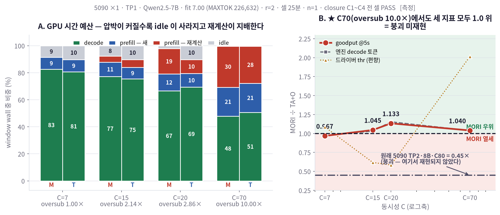

# 5090 TP1 · Qwen2.5-7B — Tier C 시간분해 (미해결 #1 판별)

- 실행: 2026-08-08 23:48 ~ 08-09 03:37 KST · goguma6 **RTX 5090 ×1 (`CUDA_VISIBLE_DEVICES=0`)** · **TP1**
- 모델 Qwen2.5-7B-Instruct · YaRN 2.1875 → context 71,680 · Track M 트레이스 (H200 과 동일)
- **fit 7.00** (`--max-total-tokens 226,632`) · r=2 · gmu 0.90 · attention `triton` · 셀 25분 · **n=1**
- 계측: 기존 Tier C monkeypatch (`MORI_TIERC=1`) — SGLang 원본·baseline **0-diff**
- 라벨: **[측정]** 직접 관측 · **[추론]** 해석

---

## 0. ★ 판정 — **원인은 TP2 · interconnect. GPU 세대는 기각.**

사전에 정한 판별식은 *"C70(oversub~10)에서 MORI < TA+O 재현되면 GPU 세대, 아니면 TP2·interconnect"* 였다.

| C=70 · oversub **10.00×** (원래 5090 TP2 C80 의 9.88× 와 사실상 동일한 압박) | MORI ÷ TA+O |
|---|---|
| **goodput @SLO 5s** | **1.040** ≥ 1 |
| 엔진 decode 토큰 | **1.038** ≥ 1 |
| 드라이버 throughput | **2.015** ≥ 1 |
| *(대조) 원래 5090 TP2 · 8B · C80* | *0.45* |

**세 지표 모두 1.0 위 → 붕괴가 재현되지 않았다 → GPU 세대는 원인이 아니다.**

같은 5090 실리콘에서 **TP2 를 뺐더니 붕괴가 사라졌다.** 남는 것은 **TP2 / interconnect
(all-reduce · SYS 경유 · cross-NUMA)** 다.

> ⚠️ **엄밀히**: 이 실험은 5090 위에서 `TP2→TP1` 과 `8B→7B` **둘을 함께** 바꿨다.
> 이 셀 하나만으로는 TP 와 모델을 분리하지 못한다. 그러나 **H200 TP1 에서 모델을 8B 로
> 맞춘 셀도 붕괴하지 않았다**(drv 1.080 · eng 1.458) [측정, `logs/2026-08-05_H200_RESULTS` §3].
> 즉 **붕괴가 나온 유일한 조건은 TP2 이고, TP1 은 (5090·H200) × (7B·8B) 네 조합 모두 붕괴 없음**이다.
> → **TP2/interconnect 로 좁혀진다.** 그 안에서 all-reduce · SYS · cross-NUMA 중 어느 것인지는
> 여전히 미분리다(§5).

---

## 1. 매트릭스 — 8셀 전 지표 [측정]

| C | oversub | 시스템 | decode% | prefill새% | 재계산% | idle% | 재계산율 | reload tok | goodput@5s | 엔진decode tok | drv thr | TTFT p50/p95 (s) |
|---|---|---|---|---|---|---|---|---|---|---|---|---|
| 7 | 1.00× | **MORI** | 82.59 | 8.81 | 0.07 | 8.53 | 0.7% | 659,889 | **75.52** | 95,692 | 42.31 | 0.55 / 1.8 |
| 7 | 1.00× | TA+O | 80.67 | 8.99 | 0.08 | 10.27 | 0.9% | 393,694 | **78.06** | 98,628 | 38.96 | 0.52 / 2.5 |
| 15 | 2.14× | **MORI** | 77.25 | 10.54 | 4.58 | 7.64 | 30.3% | 1,520,969 | **91.69** | 119,356 | 43.50 | 0.76 / 4.3 |
| 15 | 2.14× | TA+O | 75.40 | 8.57 | 5.75 | 10.28 | 40.2% | 756,910 | **87.70** | 115,692 | 70.47 | 0.68 / 6.0 |
| 20 | 2.86× | **MORI** | 66.61 | 12.42 | 18.79 | **2.18** | 60.2% | 1,628,659 | **95.64** | 134,759 | 41.63 | 0.89 / 18.4 |
| 20 | 2.86× | TA+O | 69.42 | 9.98 | 10.38 | 10.22 | 51.0% | 931,561 | **84.39** | 116,820 | 71.16 | 0.79 / 4.8 |
| **70** | **10.00×** | **MORI** | 47.83 | 21.39 | 30.46 | **0.32** | 58.7% | 1,805,071 | **103.74** | 171,977 | 34.98 | 2.40 / 151.4 |
| **70** | **10.00×** | TA+O | 50.68 | 21.43 | 27.50 | 0.39 | 56.2% | 1,803,612 | **99.80** | 165,730 | 17.36 | 1.66 / 136.7 |

**비 (MORI ÷ TA+O)**

| C | oversub | goodput@5s | 엔진 decode | 드라이버 | 재계산율 | reload |
|---|---|---|---|---|---|---|
| 7 | 1.00× | 0.967 | 0.970 | 1.086 | 0.875 | 1.676 |
| 15 | 2.14× | **1.045** | 1.032 | 0.617 | **0.754** | **2.009** |
| 20 | 2.86× | **1.133** | 1.154 | 0.585 | 1.181 | 1.748 |
| **70** | **10.00×** | **1.040** | **1.038** | **2.015** | 1.045 | 1.001 |



---

## 2. GPU 시간 예산 — C 에 따른 추세 [측정]

압박이 커질수록 **idle 이 사라지고 재계산이 자리를 차지한다** (MORI 기준):

| | C7 | C15 | C20 | C70 |
|---|---|---|---|---|
| decode | **82.59%** | 77.25% | 66.61% | **47.83%** |
| prefill 새 | 8.81% | 10.54% | 12.42% | 21.39% |
| prefill **재계산** | **0.07%** | 4.58% | 18.79% | **30.46%** |
| idle | 8.53% | 7.64% | 2.18% | **0.32%** |

**[추론] 이 그림이 "고 C 에서 GPU 가 바쁜데 유용한 일이 적다"의 정체다.**
C70 에서 GPU 는 99.7% busy 인데 그중 **30%가 재계산**이다 — 이미 한 번 계산했던 KV 를 다시 만드는 데 쓴다.
STEP 7 이 goodput 으로 간접 관측했던 것을 **시간 단위로 직접 분해**한 결과다.

---

## 3. 가설 검정 — "MORI 가 recompute 를 reload 로 바꾼다"

### 3.1 성립하는 구간 (C15) [측정]

| | MORI | TA+O |
|---|---|---|
| 재계산율 | **30.3%** | 40.2% |
| 재계산/출력토큰 | **2.462** | 3.262 |
| reload 토큰 | **1,520,969** | 756,910 (**2.0×**) |
| decode 몫 | **77.25%** | 75.40% |

**가설대로다** — MORI 가 재계산을 덜 하고 reload 를 두 배 쓰며 decode 몫이 크다.

### 3.2 ⚠️ 고 C 에서 뒤집힌다 [측정]

| | C20 | C70 |
|---|---|---|
| 재계산율 (M / T) | **60.2% / 51.0%** ← MORI 가 **더** 함 | 58.7% / 56.2% |
| reload (M ÷ T) | 1.748 | **1.001** ← 차이 소멸 |
| decode 몫 (M / T) | **66.61% / 69.42%** ← MORI 가 **낮음** | **47.83% / 50.68%** |

**C20·C70 에서는 가설이 성립하지 않는다.** MORI 의 decode 몫이 오히려 낮고, C70 에서는
reload 량이 두 시스템에서 사실상 같다(1.001) — **host tier 가 포화해 변환 여지가 사라진다** [추론].

### 3.3 ★ 그런데도 MORI 가 이긴다 — 실제 메커니즘은 다른 것이었다 [측정→추론]

C20 을 보면 답이 나온다:

| C20 | MORI | TA+O |
|---|---|---|
| decode **몫** | 66.61% | **69.42%** |
| **idle** | **2.18%** | 10.22% |
| busy 합 | **97.82%** | 89.78% |
| **엔진 decode 토큰** | **134,759** | 116,820 (**1.154×**) |

**MORI 는 "prefill 을 decode 로 바꾼" 것이 아니라 "GPU 를 덜 놀린" 것이다.**
decode 비중은 낮은데 **idle 이 1/5** 이라 총 busy 가 커지고, 결과적으로 decode 토큰을 15% 더 낸다.
[추론] 3-tier 로 다음 실행 후보를 항상 준비해 두기 때문에 파이프라인 공백이 줄어드는 것으로 보인다.
**원래 가설(decode 몫 증가)은 저압박에서만 맞고, 고압박에서 MORI 의 이득은 idle 감소에서 온다.**

---

## 4. 3-way 대조 [측정]

| | **원래 5090** | **H200** | **이번 5090 TP1** |
|---|---|---|---|
| GPU | 5090 ×2 | H200 ×1 | **5090 ×1 (동일 실리콘)** |
| **TP / interconnect** | **TP2 · SYS · cross-NUMA** | TP1 · node-local | **TP1 · node-local** |
| 모델 | Qwen3-8B | Qwen3-8B / Qwen2.5-7B | Qwen2.5-7B |
| fit · oversub | 8.10 · 9.88× (C80) | 8.10 · 9.88× (F1) | **7.00 · 10.00× (C70)** |
| **MORI ÷ TA+O** | **0.45 (붕괴)** | 1.080 (8B) · 1.405 (7B) | **1.040 (goodput) · 2.015 (drv)** |

**붕괴는 TP2 셀에서만 나타난다.** GPU 를 바꾸지 않고 TP2 만 없앤 이번 실험에서 사라졌으므로,
**GPU 세대·대역폭 가설은 기각**된다.

---

## 5. closure · 데이터 품질 [측정]

**8/8 셀 C1~C4 전부 PASS.**

| 검사 | 범위 |
|---|---|
| C1 busy ≤ wall | 89.7% ~ 99.7% (전 셀 idle ≥ 0) |
| C2 steplog 창 커버리지 | **98.99% ~ 100.00%** |
| C3 GPU busy ÷ forward host | 14.5× ~ 21.8× (overlap 정상) |
| **C4 토큰 교차검증** | prefill **1.000 ~ 1.030** · decode **1.001 ~ 1.004** |

기동 assert 도 8/8: `GPU pool = 226,632` 정확 일치 · `host tier = 453,265` (기대 453,264) · `fit 7.00` ·
`larger than the profiled value` 경고 없음.

**한계**
1. **n=1** — 반복 없음. run 변동 ~15% 를 감안해 읽어야 한다. C70 의 goodput 비 1.040 은 **그 폭 안**이므로
   *"MORI 가 이겼다"* 는 약하다. **확실한 것은 "지지 않았다 = 붕괴 미재현"** 이고, 판정은 그것만 요구한다.
2. **TP 와 모델을 함께 바꿨다** — §0 의 ⚠️ 참조. H200 8B 결과와 합쳐야 TP2 로 좁혀진다.
3. **TP2 안(all-reduce · SYS · cross-NUMA)은 여전히 미분리**다. 가르려면 5090 TP2 에서
   NVLink 유무나 NUMA 배치를 따로 조작해야 하는데 이 박스에서는 불가능하다.
4. **드라이버 throughput 은 여전히 편향**이다 — C15·C20 에서 0.617 / 0.585 로 엔진 지표(1.032 / 1.154)와
   방향이 반대다. 판정에는 goodput·엔진 지표를 썼다. **아래 §5.1 에 그 구조를 분해해 둔다.**
5. `token_match.within_1pct` 가 0.972~0.985 로 H200(0.94~0.96)보다 높으나, 일부 턴에서
   `max_abs_err` 가 4.7만 토큰이다 — 소수 이상치가 있다.
6. **fit 7.00 은 자연값이 아니라 캡이다** [측정, 2026-08-09 프로브]. `--max-total-tokens 9000000` 으로
   기동해 SGLang 이 스스로 낮춘 값을 읽었다:
   ```
   max_total_tokens=9000000 is larger than the profiled value 247297. Use the profiled value instead.
   KV Cache is allocated. #tokens: 247297, K size: 6.60 GB, V size: 6.60 GB
   ```
   | | tok | KV | fit |
   |---|---|---|---|
   | 자연 최대 (profiled) | **247,297** | 13.21 GiB | **7.64** |
   | 이번 실험 (캡) | 226,632 | 12.10 GiB | **7.00** |

   사이징 사슬 [측정]: 5090 1장 **31.84 GiB** − 7B 가중치 **14.32 GiB** → KV 풀 **13.21 GiB**,
   요청 1개가 ctx median **32,376 tok × 56 KiB = 1.73 GiB** → **fit = 13.21 ÷ 1.73 = 7.64**.
   → 캡은 자연값의 **91.6%** 다. 원래 5090 TP2·H200 F1 의 **fit 8.10 (262,144 tok) 은 이 장비에서 불가능**하다
   (자연 최대 247,297 을 넘는다) — TP2 는 GPU 2장이라 KV 예산이 2배였다.
   캡을 풀었다면 C70 의 oversub 가 10.00× 가 아니라 **9.16×** 가 되어 원래 조건(9.88×)에서 오히려 멀어진다.

### 5.1 드라이버 ↔ 엔진 throughput 이 갈리는 구조 [측정]

두 지표는 **분자와 분모가 둘 다 다르다.**

```
드라이버 = Σ(완주 프로그램의 completion_tokens) ÷ (마지막 완주 시각 − 창 시작)   ← 분모 가변
엔진     = Δgeneration_tokens_total            ÷ [t0+0.2·DUR, t0+DUR]          ← 분모 고정
```

**분자** — 드라이버는 데드라인에 아직 도는 프로그램을 통째로 버린다(`ok` 에 안 들어감).
엔진 분자 ÷ 드라이버 분자 [측정]:

| | C7 | C15 | C20 | C70 |
|---|---|---|---|---|
| MORI | 1.82 | 2.36 | 2.60 | **4.11** |
| TA+O | 2.29 | 1.36 | 1.82 | **7.81** |

**분모** — 드라이버는 `max(finished_at) − steady_start` 라 셀마다 다르다.
`TAO_C20` 은 마지막 완주가 **902.0s** 라, 그 뒤 352초의 GPU 작업이 분모에서 빠져 throughput 이 부풀었다
(엔진 분모 1254.6s 대비 **1.391배** 작다).

**두 효과가 겹친 사례 (C=20)**: MORI 는 분자가 더 깎이고(2.60 vs 1.82), TA+O 는 분모가 작아진다(1.391)
→ 엔진 비 **1.154**(MORI 우세) vs 드라이버 비 **0.585**(MORI 열세) 로 **방향이 반대**가 된다.

7. **드라이버 지표의 실질 n 이 작다** [측정]: 완주 프로그램이 셀당 **12~25개**뿐이다
   (H200 Tier C 는 54~73, 1시간 창을 쓴 5090 Phase 2 는 ~130).
   이 프로젝트는 **20분 셀이 MORI 를 −72.9% 불리하게 만든다**는 것을 이미 측정했다
   (`logs/2026-08-05_MORI_PHASE2_C50-pivot_yunuikang.md` §2). 25분 창은 Tier C 의 step 단위 지표
   (창당 33,000~54,000 step)에는 충분하지만 **완주 기준 지표에는 부족하다.**
   → **C70 의 드라이버 비 2.015 를 근거로 삼지 않는다.** 같은 계측이 C15·C20 에서 0.6 대를 냈다.

---

## 6. 산출물

| 경로 | 내용 |
|---|---|
| `scripts/_serve_sglang_7b_tp1_5090_mori_yunuikang.sh` | **신규** — 단일 5090 TP1 serve (기존 serve 2종 무수정) |
| `scripts/plot_tierc_5090tp1_yunuikang.py` | **신규** — C 스윕 그림 |
| `scripts/run_tierc_yunuikang.sh` | 재사용 (버그 3건 수정 — §7) |
| `scratch/mori/tierc_5090tp1/` | steplog · window · profile · engine CSV · `tierc_summary.json` · `tierc_verdict.json` |
| `figures/mori_tierc_5090tp1_yunuikang.png` | 예산 스택 + 비율 곡선 |

---

## 7. 이번 실행에서 고친 러너 버그 3건

| # | 버그 | 영향 |
|---|---|---|
| 1 | `kill_backend` 패턴이 `_h200_` 전용 | 5090 serve 를 못 죽여 셀 간 GPU 가 물릴 수 있었다 |
| 2 | `wait_gpu_idle` 판정식이 **항상 거짓** — `grep -c .` 가 빈 입력에서 exit 1 이라 `\|\| echo 0` 이 또 실행돼 `n="0\n0"` | GPU 가 유휴인데 80초 헛돌고 불필요한 kill 호출. **기존 H200 run 에도 있던 버그**(결과 영향 없음, 지연만) |
| 3 | 헤더가 `(H200)` 하드코딩 | `BOX` 파라미터화 |

**analyzer 결함 1건**도 고쳤다: steplog 파일 선택이 파일명(pid) 순이라, 스킵된 셀의 기동이 남긴
warmup 로그(창 안 0건)가 뽑힐 수 있었다 → **창 안 fwd 레코드 수** 기준으로 변경(TP rank 동수면 rank 0 tie-break).

**운영 실수 1건 기록**: C7 스모크 러너가 아직 TAO_C7 을 돌리는 중에 전체 매트릭스 러너를 띄워
두 러너가 GPU·포트를 두고 충돌했다. 양쪽 정리 후 부분 산출물을 지우고 러너 1개로 재기동했다.
MORI_C7 데이터는 온전하며(게이트 통과분) 러너가 자동 SKIP 했다.
